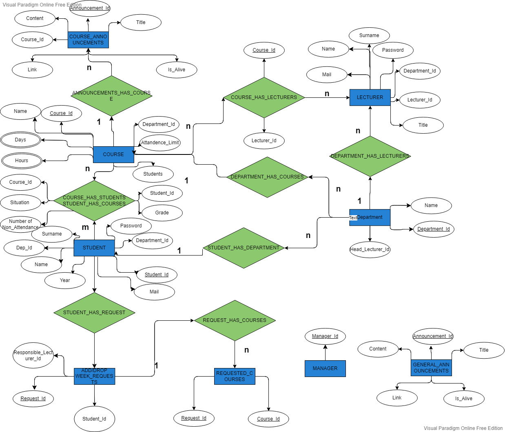

# MODERN DOKUZ EYLUL INFORMATION MANAGEMENT SYSTEM (MDEBIS)

In case of a need to reach the creators, please use the following e-mails

Emircan Tepe: emircan.tepe@ceng.deu.edu.tr
  
Deniz Küçükkara: deniz.kucukkara@ceng.deu.edu.tr

# Contents
- [MODERN DOKUZ EYLUL INFORMATION MANAGEMENT SYSTEM (MDEBIS)](#modern-dokuz-eylul-information-management-system-mdebis)
- [Contents](#contents)
- [SYSTEM ARCHTIRECTURE ](#system-archtirecture-)
- [USED TECHNOLOGIES, TOOLS AND PROGRAMMING LANGUAGES ](#used-technologies-tools-and-programming-languages-)
- [DATABASE ](#database-)
	- [Relationships](#relationships)
	- [Stored Procedures](#stored-procedures)
	- [Views](#views)
	- [Triggers](#triggers)
- [ADDITIONAL PROPERTIES](#additional-properties)
	- [Filling with Real Data using web-scraping methods](#filling-with-real-data-using-web-scraping-methods)
	- [Password Protection](#password-protection)
	- [Performance Measurement](#performance-measurement)
	- [Holding Token in the Cache](#holding-token-in-the-cache)
- [HOW TO RUN ](#how-to-run-)

# SYSTEM ARCHTIRECTURE 
The well-known and widely used Model-View-Controller (MVC) architecture is applied with its all design patterns. It is based on the separating information from its representation. Below figure is the general representation of MVC.

Representation of MVC, taken from <a href="https://en.wikipedia.org/wiki/Model%E2%80%93view%E2%80%93controller">WikiPedia</a>

# USED TECHNOLOGIES, TOOLS AND PROGRAMMING LANGUAGES 

Below are given the programming languages, technology and tools throughout the project development.
<ol>
<li><b>GOLANG </b>(<i>Model</i>): A functional programming language designed by Robert Griesemer, Rob Pike, and Ken Thompson. It is syntactically similar to C, but with additionally memory safety, garbage collection, structural typing, and CSP-style concurrency.</li>
<li><b>HTML</b> (<i>View</i>): HTML (Hypertext Markup Language) is a standard markup language for creating web pages and web applications. It is used to structure and organize content on the web, and to define the meaning and structure of that content. HTML consists of a series of elements, which are used to enclose, format, and link different types of content. When a web browser receives an HTML document, it reads the HTML code and uses it to render the content of the page on the user's screen.</li>
<li><b>Cascading Style Sheets</b> (<i>CSS</i>) (View): CSS is a stylesheet language used for describing the look and formatting of a document written in HTML. CSS is used to define the layout and design of web pages, including colors, fonts, and responsive design. It is used to apply styles to web pages, such as specifying that certain text should be displayed in a particular font or that certain elements should be positioned in a certain way on the page. By separating the presentation of content from the content itself, CSS allows web designers and developers to create more flexible and adaptable websites.</li>
<li><b>JavaScript</b> (View & Controller): JavaScript is a programming language that is commonly used to create interactive effects within web browsers. It is an implementation of the ECMAScript specification and is used to enable web pages to be dynamic and interactive. JavaScript code is run on the client side, meaning it is executed by the user's web browser rather than on the server. It can be used to create things like dropdown menus, form validation, and interactive maps. JavaScript is an essential component of modern web development and is used on the majority of websites.</li>
<li><b>REACT </b>(View & Controller): React is a JavaScript library for building user interfaces that was developed by Facebook. It is commonly used for building single-page applications and mobile applications, and allows developers to create reusable UI components that can be rendered on the server or the client. React uses a virtual DOM to optimize the rendering of UI elements, and has a declarative programming style, which means that the code specifies what the UI should look like rather than describing the steps to create it. </li>
<li><b>MYSQL </b>(DB): MYSQL is one of the well-known and most-used relational DBMS.</li>
<li><b>Python</b>: Python is not used any part of the project that can effect any performance. It is only used as a tool when doing web-scraping </li>

# DATABASE 

 The database is created using MySql. It is currently in the third normal form. Below is the ER diagram of the DB.

 

ER diagram, created on [VisualParadigm](https://online.visual-paradigm.com/)

Mainly, our ER design has 6 entity, There is no need to explain everyg entity in detail, we belive it is already clear from the figure what entity has which attributes but the relationships existing in the DB is explained below in detail.

## Relationships

1.	Course_Has_Student/Student_Has_Courses (M:N): There exists a many-to-many relationhsip between course and student entity. It can be verbally said that “A student has many courses while a course has many students.” 

2.	Student_Has_Request(1:1): A one-to-one relationship exists there, because a student can own only one request at a time, if the student make another request after a request, the old request will be deleted. 

3.	Course_Has_Lecturer (N:M): There exists many-to-many relationship because a course can be given by more than one lecturer at the same time, and in the same manner a lecturer can give many courses at the same time. 

4.	Course_Has_Tıme (1:N): There exists one-to-many relationship because a course can have many time while a time record can only belong one course at a time. This is also a restriciton. A time information could have given many courses so that the storage is decreased and query performance is increased, but at the end of the day, because it is a must to specify a course along with which time, there will be again many rows, so as a results it is not applied.

5.	Department_Has_Lecturers (1:N): There exist a one-to-many relationship because while a department can have more than one lecturer who are serving the depratment, one lecturer can belong only one department.  

6.	Department_Has_Courses (1:N): There exists a one-to-many realtionship. A department can have more than one course while a course should be given only one deparment (meaning lecturers have to come from the same department | second assumption here.) 

7.	Announcement_Has_Course(1:N): There exists a one to many relationships. One course can have more than one announcement but an announcement has to belong only one course.

## Stored Procedures
The DB has three stored procedures given below in detail. These are one of the most used 	DB queries because these are must to be able to log in the system, so that is why these are chosen 	as stored procudures, meaning they will reduce the network traffic.
1.	student_login: This procedure takes student id as an argument and returns the hashed password if found, otherwise an empty result set.
2.	lecturer_login: This procedure takes lecturer id as an argument and returns the hashed password if found, otherwise an empty result set.
3.	admin_log: This procedure takes admin id as an argument and returns the hashed password if found, otherwise an empty result set.

## Views
The system has two views. Both of them are based on join queries. Below they are given in detail.
1.	student_department: Because our DB design is in third normal form, the student record has only the department id information instead of having full department information, preventing duplicatin areas over and over again. This gets a performance decrement when it comes to querying information about students because whenever a student logs in the system, the DB will make a search in the department table. A view is created by joining students and deaprtments using deaprtment id keyword to reduce this performance overhead. 
2.	department_head: Similarly with the above view, this view is also created for the same purpose. This one joins department and its lecturer, specifically the head lecturer. 

## Triggers
The DB has two main triggers which are given below in detail. These are used to reduce the workload of GO.
1.	E-mails of users:
Because every type of user in the system has an e-mail, the e-mails of them are created using triggers by also taking care of domain names, meaning if,

	Student   --> (name).(surname)@ogr.deu.edu.tr

	Lecturer  --> (name).(surname)@deu.edu.tr

	Manager   --> (name).(surname)@admin.deu.edu.tr

2.	Non-attendance limit:
A course has a non-attendance limit (-1 indicates no limit exists.) and when a lecturer enters a non-attendance information of a student in one of her/his courses, the DB automatically checks that whether the student should fail or not. If the student passes the course non-attendance limit, then student will be automatically labeled as failed n this course.

# ADDITIONAL PROPERTIES
There exists four additional properties in scope of the project. These wil be explained below in detail.
## Filling with Real Data using web-scraping methods
Instead of filling a few data with hands, we decided to take help from the publicly available data sources in the internet to make our DB real, or close to real. From collecting the data to insert it to DB, Python is used as programing language. It was preferred because of its easy-to-use libraries and so short time development time. Also, becase the job is a one-time job (collect and insert) we also did not need to consider about performance problems although 	this process (in terms of runtime) would be shorter in other programming languages.

There are two main resources we used, 
1. Dokuz Eylül University Course Catalog Information Package 
2. Name library. The course catlog consists of all the departments and the offered courses by the department to their students. The library is a publicly available aiming to produce name and surname pairs randomly upon requests. That is how we created our students and lecturers. 
3. When creating students, lecturers, courses, assigning time information to created courses and deciding which lecturer is the head of a department (of course by taking care which department the lecturer works), etc. Random library is also used in the creation phase. 

| **Entity Name**     | **Number of Created Rows** |
|---------------------|----------------------------|
| Student             |           74.995           |
| Lecturer            |            1.358           |
| Course              |            5.148           |
| department          |             104            |
| course_has_time     |            5.191           |
| course_has_student  |          1.044.108         |
| course_has_lecturer |           12.843           |

Randomly filled entities and their number of rows

Above table shows the number of rows created randomly on only the entities randomized function were worked on, not all entitites. As can be seen from the table, number of course per lecturer (3.8..) is approximately 4.

When creating students, the year the student came into the university was also taken into account and course_has_time table filled according to this arrangement, meaning less starting year indicates much more courses taken, resulting a total of 1 million rows approximately.

With many other additional feature, laslty it should also be noted that primary key of the students, in other words student_id column of student entity was also created in a manner, such that the same in Dokuz Eylül university, which is as follows:

xxxxyyyzzz 

xxxx  --> Year

yyy   --> Deparmtent code 

zzz   --> Which student in the department in the same year

## Password Protection
Although this is not a requiremet given in the course assignment, we decided to find a way to store the user passwords in a secure way. After a short research, it is found that it is possible to store the passwords by hashing, providing end-to-end protection, meaning that the password is only known by the user. 
 

Figure 7: Password protection steps, created by us on PowerPaint.

So, in the current snap-shot of our system, all passwords are stored as hashed and when a user attempts to log in, the system first hashes what it enters, then gets the hashed password (the password used when signing up) from DB and check whether they are equal or not. If equal, then the user succesfully logs in, but otherwise the log in fails.
	
## Performance Measurement
After completing all the project development, a basic performance measurement is conducted on the DB and back-end in the GO environment. 1000 requests which are created at the same time and running parallelly, aiming first log in and then getting a timetable of a student, took approximately 3.21 sec. after these steps are repeated 1000 times. The releated script is also shared.

## Holding Token in the Cache
Session storage is a type of web storage that allows data to be stored in the browser's memory for a single session. This means that the data is only available to the current browser window or tab and is deleted when the user closes the window or tab. Session storage is useful for storing small amounts of data that need to be accessed during a single browsing session, such as a user's login token. Data can be stored in session storage using the setItem method and retrieved using the getItem method.
In the context of user authentication, session storage can be used to store a user's login token after a successful login. When a user logs in to a site, a request is sent to the backend with the user's login credentials. If the login is successful, a token is generated by the backend and sent back to the frontend in the response. The frontend can then store the token in session storage so that it can be accessed on subsequent requests. This allows the frontend to authenticate the user on subsequent requests without requiring the user to enter their login credentials again.

# HOW TO RUN 

To be able to run this project succesfully with its all components, one needs following tools:
<ul>
	<li>NodeJs (https://nodejs.org/en/download/)</li>
	<li>REACT library (run the command "npm install", then "npm start" under the mdebis folder)</li>
	<li>GOLANG (https://go.dev/dl/)</li>
	<li>MYSQL (https://www.mysql.com/downloads/)</li>
</ul>

 
Lastly, it is also a need to import the database that will be used by the program to your local mysql server

You can use the dump file provided under this folder to import the mdebis database 

After all these steps, to run the mdebis, please follow the below steps in order:

<ol>
	<li>Go to server folder</li>
	<li>Run "go run ./"</li>
	<li>If the above command produces an error, please run "go mod init mdebis", then "go install .", then "go run ./"</li>
	<li>GO TO MDEBIS FOLDER</li>
	<li>Run "npm install" command. this command may take some time, please wait.</li>
	<li>Run "npm start" command. after compilation, home page of mdebis will start on your main web browser.</li>
	<li>DONE :)</li>
</ol>

Our database is created with data taken from the internet using web scraping methods.

So instead of using a randomly chosen user, you can use the below ones to see the all the features of mdebis.

Student id: 2015537117 | 2019537310 | 2016537990 

Lecturer id: 2020537421

Admin id: 1  

All passwords are 354152.
